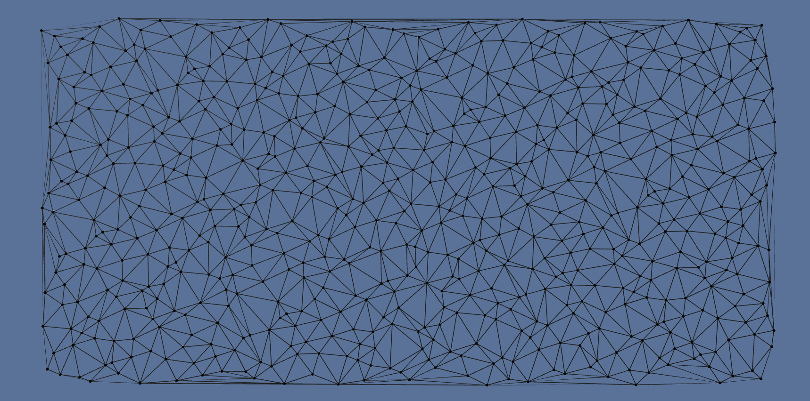
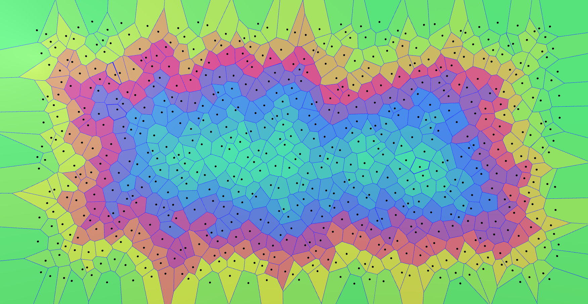

# Delaunay / Voronoï diagrams (Delaunoï)

**Delaunoï** is a 2D library to construct `Delaunay triangulations` and `Voronoï diagrams`
using [QuadEdge](https://en.wikipedia.org/wiki/Quad-edge) datastructure as described
by **Leonidas J. Guibas** and **Jorge Stolfi** in the paper
[Primitives for the manipulation of general subdivisions and the computation of Voronoi diagrams](https://dl.acm.org/citation.cfm?doid=282918.282923).

This library targets `.NET framework 4.6.1`. In order to please **Unity** you must update your
**Scripting Runtime Version** to **4.X** (`Edit/ProjectSettings/Player/OtherSettings`)

# Getting started:

Unity examples can be found in `Assets/Scenes/GuibasStolfiTest`.

# References:

**Triangulation / Voronoï**:

  - [Guibas and Stolfi paper](https://dl.acm.org/citation.cfm?doid=282918.282923)
  - [Geometry predicates](https://www.ics.uci.edu/~eppstein/junkyard/)
  - [Voronoi diagram](https://en.wikipedia.org/wiki/Voronoi_diagram)

**Generators**:

  - [Halton low-discrepancy sequence](https://link.springer.com/article/10.1007/BF01386213)
  - [Poisson disk sampling](https://dl.acm.org/citation.cfm?id=1278807)
  - [Low-discrepancy sequence](https://en.wikipedia.org/wiki/Low-discrepancy_sequence)
