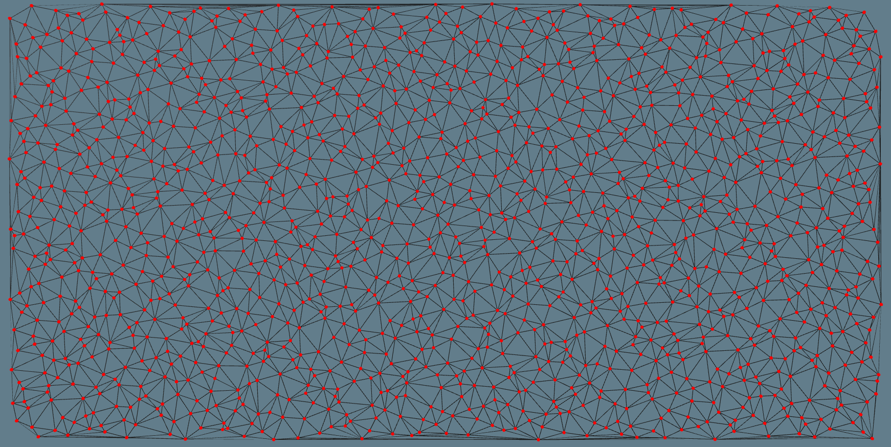
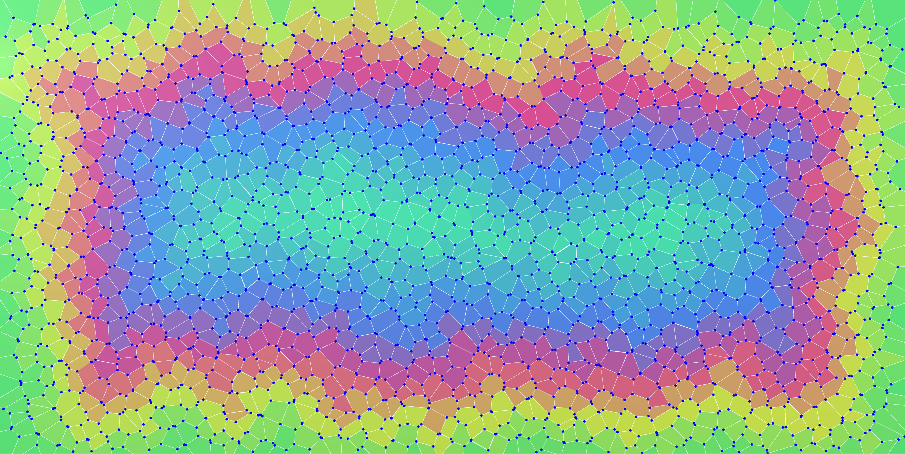
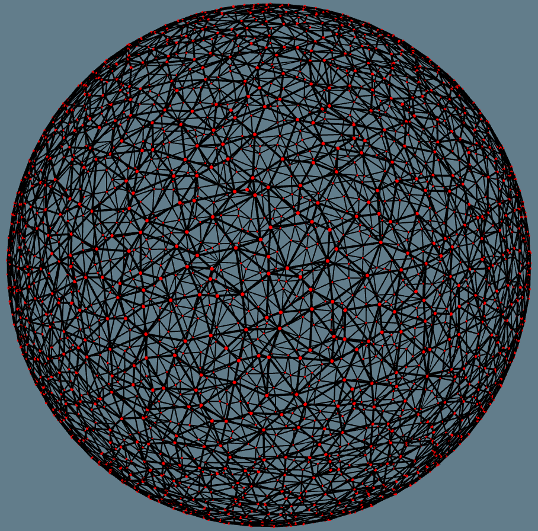
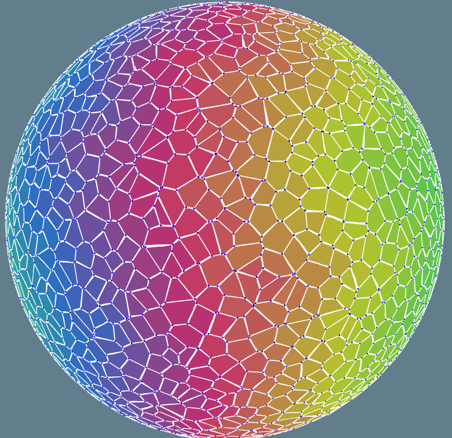

# Delaunay / Voronoï diagrams (Delaunoï)

**Delaunoï** is a 2D library to construct `Delaunay triangulations` and `Voronoï diagrams`
using [QuadEdge](https://en.wikipedia.org/wiki/Quad-edge) datastructure as described
by **Leonidas J. Guibas** and **Jorge Stolfi** in the paper
[Primitives for the manipulation of general subdivisions and the computation of Voronoi diagrams](https://dl.acm.org/citation.cfm?doid=282918.282923).

This library targets `.NET framework 4.6.1`.

## Applications:

  - Delaunay triangulation on plane / sphere
  - Voronoi / Centroid / Incenter diagram on plane / sphere
  - Random points sampling (Uniform, Halton, Poisson, Fibonnaci) on plane / sphere

# Getting started:

Unity examples can be found in:

  - Plane: `Assets/Scenes/GuibasStolfiTest`
  - Sphere: `Assets/Scenes/SphereSamplerTest`
  - Poisson sampling: `Assets/Scenes/PoissonDiskTest`

In order to please **Unity** you must update your **Scripting Runtime Version** to **4.X** (`Edit/ProjectSettings/Player/OtherSettings`)

# References:

**Delaunay triangulation**:

  - [Guibas and Stolfi paper](https://dl.acm.org/citation.cfm?doid=282918.282923)
  - [Delaunay](https://en.wikipedia.org/wiki/Delaunay_triangulation)
  - [Star shape polygon](https://en.wikipedia.org/wiki/Star-shaped_polygon)
  - [Stereographic projection](https://en.wikipedia.org/wiki/Stereographic_projection)
  - [Interactive projection](https://eater.net/quaternions/video/stereo2d)

**Voronoï diagrams**:

  - [Voronoi diagram](https://en.wikipedia.org/wiki/Voronoi_diagram)
  - [Geometry predicates](https://www.ics.uci.edu/~eppstein/junkyard/)
  - [3D circumcenter](https://gamedev.stackexchange.com/questions/60630/how-do-i-find-the-circumcenter-of-a-triangle-in-3d)

**Generators**:

  - [Halton low-discrepancy sequence](https://link.springer.com/article/10.1007/BF01386213)
  - [Poisson disk sampling](https://dl.acm.org/citation.cfm?id=1278807)
  - [Low-discrepancy sequence](https://en.wikipedia.org/wiki/Low-discrepancy_sequence)
  - [Spherical Fibonacci Mapping](https://dl.acm.org/citation.cfm?doid=2816795.2818131)
